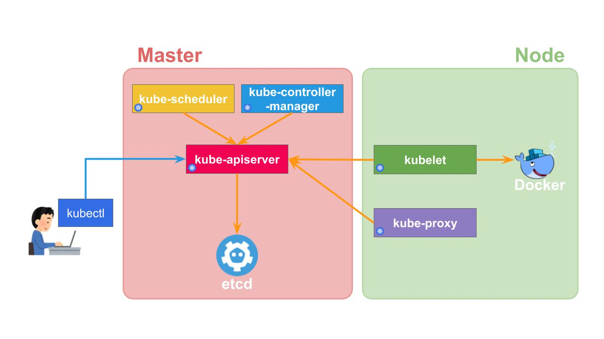

# What is Kubernetes?

Kubernetes is a container orchestration platform. Deploy, scale, and manage automated containers. 

# What can you do with Kubernetes?
 
- Deploying containers to multiple hosts
- Container health check
- Scaling the container
- Service Discovery
- Rolling update of the deployed container
- Monitoring and Logging
- Authn/Authz
- Storage Mounting

# Why learn Kubernetes?

- Almost the de facto as a container management tool
- Separation of Dev and Ops
- Infrastructure as Code
- Integration with other ecosystems

# Kubernetes Architecture

Kubernetes is divided into two main roles.

**The Master**

- kube-apiserver: API provision and Authn/Authz
- kube-controller-manager: Controlling resources
- kube-scheduler: Container Scheduling
- etcd: Persistence of cluster data

**The worker**

- kubelet: Start and monitor containers
- kube-proxy: Transfer of connections
- Container Runtime: Container runtime. Docker and cri-o.