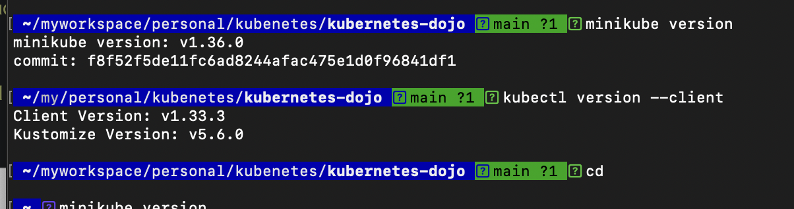
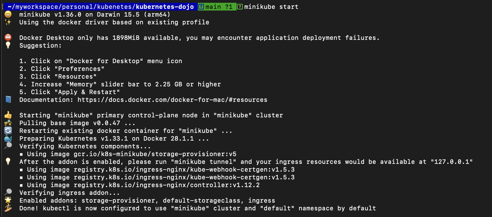
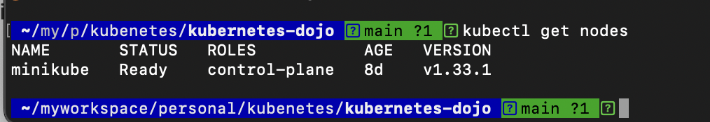

# Build a local Kubernetes environment

## [Minikube](https://github.com/kubernetes/minikube)

Minikube is a tool for building Kubernetes on a local machine.

Minikube can be used by multiple drivers and can be built using the following virtualization mechanism.

- The virtual box
- vmware
- kvm2
- kvm
- The hyperkit

Using these virtualization mechanisms, we create a VM and build Kubernetes on that VM.

## Installation of Minikube

Since I'm currently using Mac, you can implement it by executing the command :

```
curl -LO https://github.com/kubernetes/minikube/releases/latest/download/minikube-darwin-amd64
sudo install minikube-darwin-amd64 /usr/local/bin/minikube
```

## Install kubectl

Install it using brew :
 
```
brew install kubernetes-cli
```

## Building a local environment for Kubernetes using Minikube

I worked on the following version.



it's very easy to build. `minikube start` Just execute it.



When the command is executed, the Kubernetes construction of the local environment is complete.

