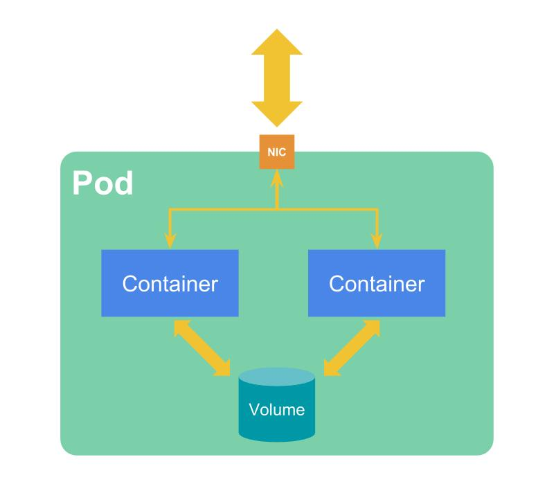
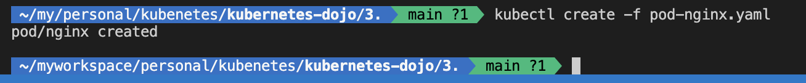
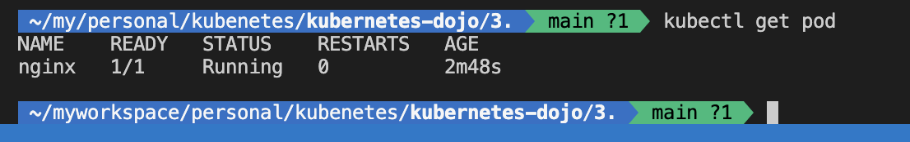
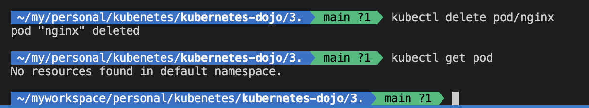

# Pod

Pods have the following features in the smallest units that can be deployed to Kubernetes:

- A group of one or more containers
- Shared networks and storage
- Pod content is deployed to the same node.



## Create a Pod Manifest

You need to create a Kubernetes Manifest file to create a Pod.

The following is the Manifest of the Pod that uses nginx images.

```
apiVersion: v1
kind: Pod
metadata:
  name: nginx
spec:
  containers:
  - name: nginx
    image: nginx
```

So, where do you write this in terms of writing?

This is the Kubernetes API. The API data is described in yaml.

[Kubernetes API Reference Docs v1.33](https://kubernetes.io/docs/reference/generated/kubernetes-api/v1.33/)

The above reference is from Version 1.33. Let's follow the items of the Manifesto above based on this document.


The Pod article [is here](https://kubernetes.io/docs/reference/generated/kubernetes-api/v1.33/#pod-v1-core).


### api version

- Specifies the version of Schema of the object.

### Kind of

- Specify the name of the object to be created.

This time to create a Pod. Podspecifies.

### The metadata

- Specifies the metadata of the object.

### spec

- Define the expected state of the object.

## Using Manifest to Create Pods

Now, let's create a Pod using the Manifest that I mentioned earlier. 

1. The first Manifest file pod-nginx.yaml

Use the command `kubectl crete`.  `-f` Optionally specify the Manifest file.

```
kubectl create -f pod-nginx.yaml
```


Now I can create the pod. Let's check it out. Use the command :

```
kubectl get pod
```



To delete the pod, use :

```
kubectl delete pod/nginx
```

